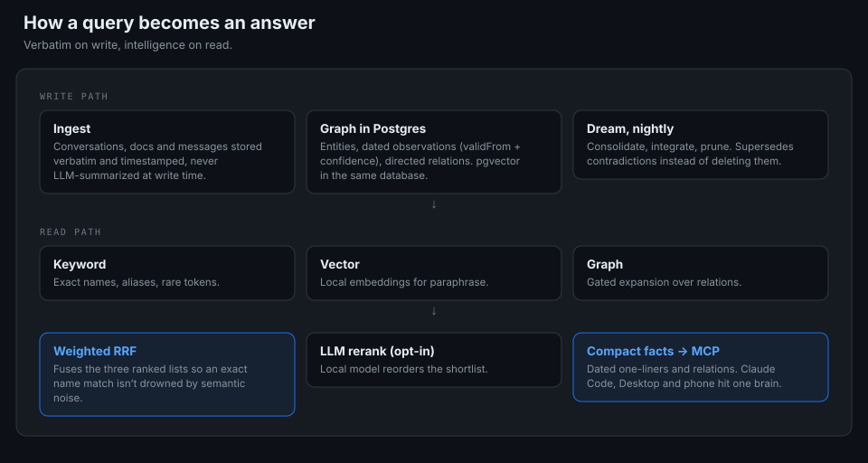
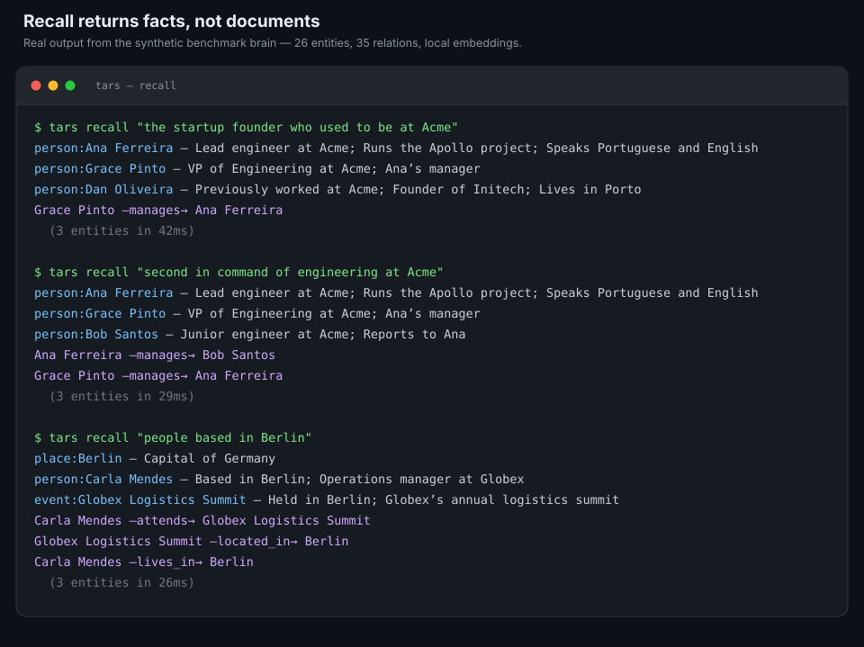
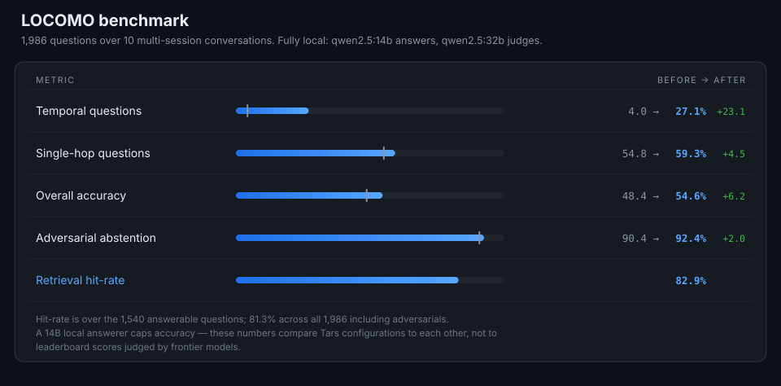

# I gave Claude a memory, then a personality, and the personality made it hallucinate less

_Tars is my personal second brain for Claude: a memory graph over MCP, fully local, benchmarked, and now open source._

_August 2026_

About a month ago I joined a new company. Everything was new to me. I hadn't joined a new company in four years, and I got honestly scared of landing without context. Lost in meetings. Asking questions that were answered months ago in a channel that I never got to read. Taking weeks to add value because the context lives in other people's heads and in a thousand documents I haven't opened.

So I had an idea. A personal agent that could genuinely know and remember everything around my life. An agent that gathers context on its own and works as a second brain, that helps me brainstorm, that remembers facts nobody even shared with me personally because they were said in a meeting, a document, an open channel.

I got to building.

## The memory problem

I had been testing OpenClaw and a few different agent SDKs, but for some reason I always came back to Claude Code. It was just always the best harness for me. There was one problem I could never get around, though, and it's the memory.

The usual setup is markdown files plus vector search, and it fails you quietly. Sometimes the search just doesn't find the fact, even when you know it's written down somewhere. When it does find something, you get a wall of raw text instead of clean facts, and now your agent is burning half its context window re-reading a document to extract one sentence. And everything has the same weight. A decision from last year and what I had for lunch on Tuesday sit side by side, with no separation between long-term knowledge and short-term noise, and no notion of when a fact was true or whether it still is.

There's so much to improve there. So I built the memory layer I wanted.

## What Tars actually is

Tars is a self-hosted memory server. The data model has three pieces: entities (people, projects, places, events, whatever matters), timestamped observations (atomic facts about an entity, each with a "valid from" date and a confidence), and directed relations between entities ("works_with", "lives_in", "member_of"). It's a graph of your life, stored in Postgres with pgvector, running on your own machine.

_The write path stores facts as they were said. The read path does the work._

Ingest is verbatim and timestamped, not LLM-summarized. This was a deliberate choice. Most memory systems distill what you tell them into a summary at write time, which sounds efficient until you need the exact detail six months later and it was compressed away. Tars stores what was actually said, stamped with when it became true, and does the intelligence at read time instead.

Recall is hybrid. A query runs keyword search, vector search, and graph expansion in parallel, and the ranked lists get fused with weighted reciprocal rank fusion, so a strong exact-name match doesn't get drowned by semantically-adjacent noise. What comes back is compact: entities, their relevant dated facts, and how they connect. Facts, not walls of text.

_Three real queries against the synthetic benchmark brain. "The startup founder who used to be at Acme" contains none of the words in Dan Oliveira's record, and "second in command" appears nowhere in the graph. The relation does the work. Under 45ms each, embeddings and all, on a laptop._

The whole thing is exposed over MCP, the Model Context Protocol, which is the standard that lets Claude and other assistants call external tools. Tars exposes 13 memory tools (remember, recall, link, correct, timeline, and so on), and because it's one HTTP server, the same brain is reachable from Claude Code, Claude Desktop, and my phone. I ask something on mobile and it recalls what a coding session stored last week.

## It learned how to dream

Storing facts is the easy half. The interesting half is what happens to them overnight.

Every night Tars runs a routine called Dream, loosely modeled on how sleep consolidates human memory. It replays the day's conversations and moves durable facts into the graph. Then it integrates. It links new entities to old ones, infers relationships the day implied but never stated, and reconciles contradictions by superseding the outdated fact instead of deleting it, so history is preserved. Then it prunes. Duplicates get merged, trivia fades, and facts that got independently confirmed again get strengthened.

The last stage leaves a short note for the morning, a few bullets on what's still open, so the next session starts oriented instead of cold. The neuroscience framing sounds cute, but the ordering genuinely matters. Consolidate first, integrate second, prune throughout. Two dreams over the same day converge instead of duplicating, because every write checks what's already stored.

## The honesty dial

I got the idea for the personality while showing Interstellar to a friend. TARS, the robot in the movie, has tunable settings, humor at 75 percent, honesty at 90. I thought it would be a fun system prompt, so I wrote one where the persona's dials are real: the user can say "humor to 40" and the behavior scales.

Then something happened that I didn't expect. Setting the honesty dial very high made the model hallucinate less.

I think the mechanism is simple. A model tuned to be agreeable treats "I don't know" as a failure, so when recall comes back thin, it fills the gap with something plausible. A persona whose whole identity is blunt honesty is never scared of being wrong. It says "not in memory" and moves on. The persona I built as a joke turned out to be a working abstention mechanism, and I now treat it as part of the architecture.

## Does it actually work?

I didn't want to trust vibes on this, so I benchmarked it on LOCOMO, snap-research's long-term conversational memory benchmark. Ten very long multi-session conversations, 1,986 questions. Every dialogue turn gets ingested into a real Tars brain as a verbatim, timestamped observation, and the answerer is only allowed to use what `memory_recall` retrieves.

The whole run is local. A `qwen2.5:14b-instruct` answers, a `qwen2.5:32b-instruct` judges, `nomic-embed-text` does embeddings, all through Ollama. No cloud API touches the benchmark.

The headline numbers: retrieval hit-rate is 82.9 percent, meaning the gold evidence turn lands in the recalled context 82.9 percent of the time, measured over the 1,540 answerable questions. That figure excludes LOCOMO's 446 adversarial questions, whose "evidence" is a deliberate distractor and where the correct behavior is to abstain; over all 1,986 it's 81.3 percent. Overall answer accuracy went from 48.4 to 54.6 percent.

_Grey tick marks where each metric started. The temporal jump is the date-rendering fix described below._

The jump came from a fix I'm fond of, because it was a proper detective story. Temporal questions ("when did X happen?") were scoring 4 percent, catastrophically bad, and my first assumption was retrieval failure. It wasn't. The hit-rate on those questions was fine; the model had the fact sitting right there in context. The problem was that the fact carried a relative, unformatted sense of time, and a model can't compute "the Saturday before last" from a pile of turns. Tars already stores an absolute `validFrom` date on every observation, so the fix was to surface it, prefixing every recalled line with its bracketed date. Temporal accuracy went from 4 to 27.1 percent, single-hop went from 54.8 to 59.3, and adversarial abstention held, actually rising from 90.4 to 92.4 percent. The memory was never wrong. The rendering was.

Now the caveat, and I refuse to bury it: a 14B local answerer caps answer accuracy. These numbers are honest for comparing Tars configurations against each other, and they are not comparable to vendors' leaderboard scores judged by GPT-4-class models. If you swap in a bigger answerer the accuracy goes up; the retrieval hit-rate is the model-independent signal, and that's the number I actually optimize. The whole benchmark harness ships in the repo, so you can reproduce every figure on your own laptop.

## Run it

Tars ships completely empty. No data, no assumptions about whose life it is, just the engine and the schema. It runs on your own machine, Postgres and all, and in its default configuration nothing ever leaves the box. On Linux it's one `docker compose` command plus one `claude mcp add`; on macOS there's a `make setup` that provisions everything, and an agent-first installer you can literally hand to Claude Code and let it set itself up.

It's MIT licensed. Setup instructions are in the [README](../README.md), and the benchmark harness is under [`packages/core/src/eval`](../packages/core/src/eval).

If you're a developer or a vibe coder, I genuinely think this adds value to your setup, whatever harness you run. And more than users, I want other minds on it. There's a lot I still want to try, better consolidation, smarter forgetting, richer temporal reasoning, and I can only go so far alone. Clone it, run the benchmark, break it, and send me what you find.
